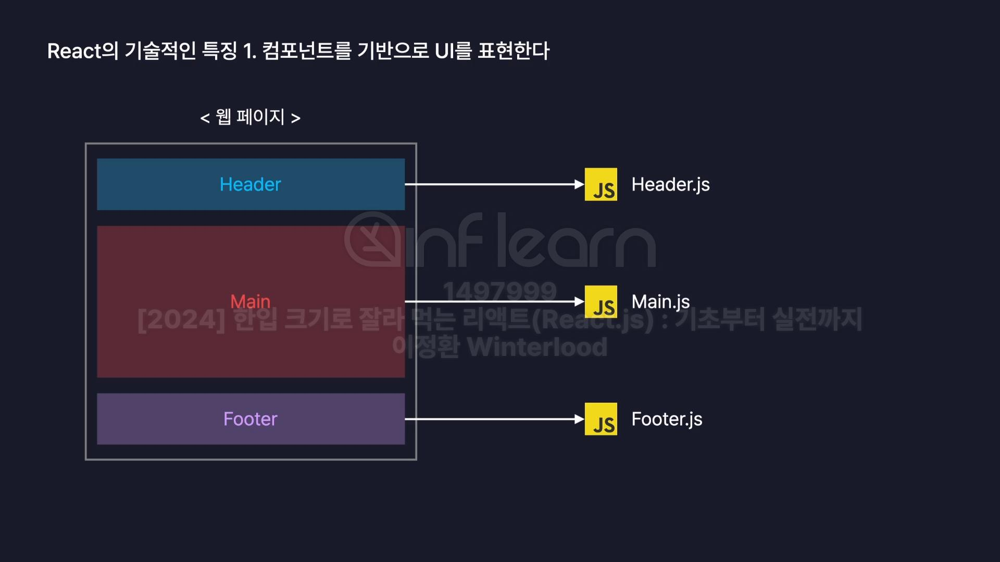
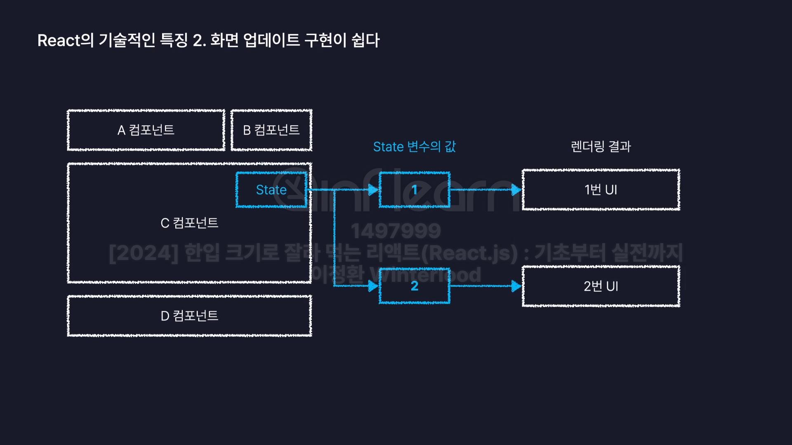
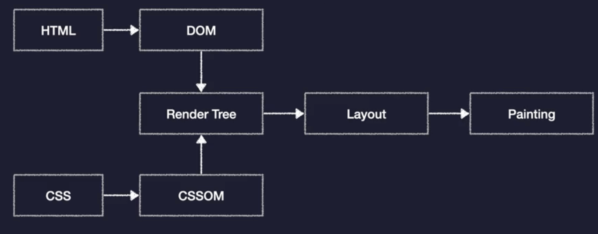
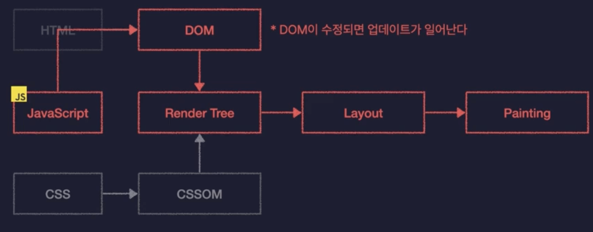
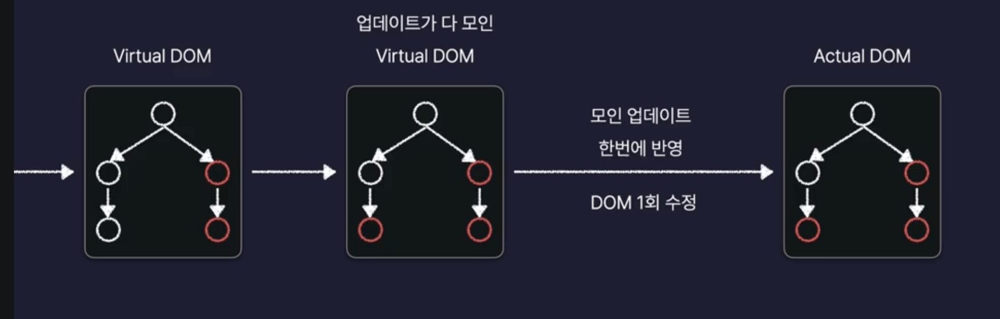
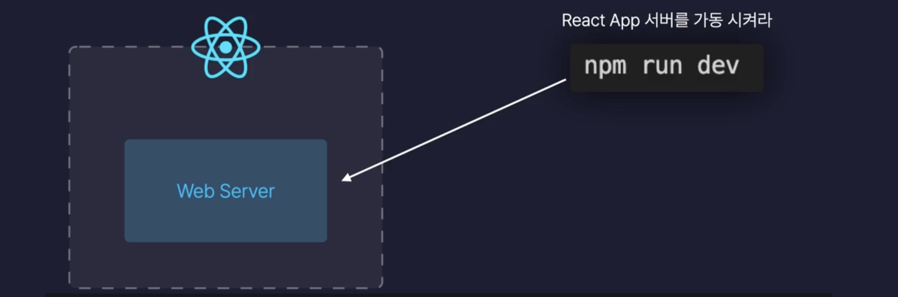

# React
: Meta(Facebook)이 개발한 오픈소스 JavaScript 라이브러리
- 대규모 웹 서비스의 이를 더 편하게 개발하기 위해 만들어진 기술

## 기술적 특징
1. 컴포넌트를 기반으로 비를 표현한다
2. 화면 업데이트 구현이 쉽다
3. 화면 업데이트가 빠르게 처리된다

### 기술적 특징 1. 컴포넌트를 기반으로 비를 표현한다
`컴포넌트 (Component)` : 우리말로 "구성요소" 라는 뜻
- 화면을 구성하는 요소, UI를 구성하는 요소를 말함

    - 자바스크립트 파일에 컴포넌트 단위로 나눠서 모듈화해서 보관
    - 중복코드를 제거하는 관점에서 매우 큰 장점이 된다
    - 만약 헤더 컴포넌트를 사용한다면 이를 만들고 여러 페이지에서 불러와서 사용
    - 수정사항이 발생하더라도 해당 컴포넌트만 수정하면 되기 때문에 유지보수 측면에서 유리

### 기술적 특징 2. 화면 업데이트 구현이 쉽다
`업데이트란?` : 사용자의 행동(클릭, 드래그)에 따라 웹 페이지가 스스로 모습을 바꿔 상호작용 하는 것
- React.js에서는 화면 업데이트를 구현하기 쉽다
- 선언형 프로그래밍
    - 과정은 생략하고 목적만 간결히 명시하는 방법

각각의 컴퍼넌트에는 이렇게 State라는 파란색으로 스테이트라는 현재의 이 컴퍼넌트의 상태를 저장하는 특수한 변수가 존재

- state의 값이 바뀌면 바뀐 스테이트 값에 따라 각각 다른 UI를 화면에 랜더링 할 수 있다.
    - 화면의 업데이트가 필요할때 컴포넌트가 가진 State라는 변수의 값만 바꾸면 자동으로 다른 버전의 UI를 렌더링
 

 >  정리 : 업데이트를 위한 복잡한 동작을 직접 정의할 필요 없이 특정 변수의 값을 바꾸는 것 만으로도 화면을 업데이트 시킬 수 있다.

 ### 기술적 특징 3. 화면 업데이트가 빠르게 처리된다
 `Critical Rendering Path`
 
 단계별로 이해 
 1) 먼저 첫 번째 단계에서는 HTML과 CSS를 각각 DOM이라는 것과 CSS Object Model로 변환
 2) DOM과 CSS Object Model을 합쳐 Render Tree를 만든다 
    - 웹페이지의 청사진, 설계도
    - 화면에 랜더링 되어야 하는 HTML, CSS 모든 정보를 포함
3) 레이아웃
    - 웹페이지라는 공간안에 렌더트리에 포함되어있는 요소들의 배치를 잡아보는 것
4) 페인팅
    - 요소를 실제로 화면에 그려내는 것

: 화면이 수정되면 렌더트리를 다시 생성하고 레이아웃을 다시 잡고 페인팅을 다시 진행

레이아웃과 페인팅은 오래 걸리는 과정이다 -> 성능저하 발생
`Reflow`: Layout을 다시 한다
`Repaint`: Painting을 다시 한다

> 다양한 업데이트가 있을 때 동시에 발생한 업데이트를 모으고 다 모였다면 한번에 수정!
-> 서비스의 규모가 커질수록 점점 힘들어짐
#### 리액트는 이과정을 자동으로 처리해 준다! Virtual DOM을 이용

### React 폴더
public : 정적 파일을 보관하는 저장소 / 이미지, 폰트
src : 소스의 약자, 
    - jsx : react의 확장자
eslint : 코드스타일을 통일하는 도구
gitignore : 깃허브업로드시 
index.html : 기본틀역할

### localhost:5173

localhost : 내 컴퓨터의 주소
5173 : 포트번호
- 내 컴퓨터에서 리엑트 웹서버에 접속 요청을 보낸다
- 다른 컴퓨터에서 접속하는 것은 불가능하다.