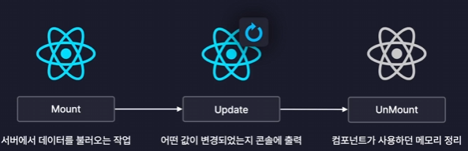
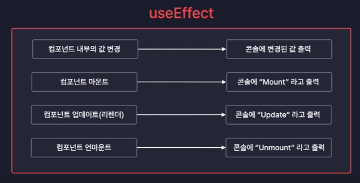

### 라이프사이클 (Life Cycle) = 생애주기

> Mount -> Update -> UnMount

#### 1. Mount 
Like 탄생
- 컴포넌트가 탄생하는 순간
- 화면에 처음 렌더링 되는 순간

따라서 A 컴포넌트가 Mount 되었다 

    => A 컴포넌트가 화면에 처음 렌더링 되었다.

#### 2. Update 
Like 변화
- 컴포넌트가 다시 렌더링 되는 순간
- 리렌더링 될 때를 의미

따라서 A 컴포넌트가 Update 되었다 

    => A 컴포넌트가 화면에 리렌더링 되었다.

#### 3. UnMount
Like 죽음
- 컴포넌트가 화면에서 사라지는 순간
- 렌더링에서 제외되는 순간을 의미

따라서 A 컴포넌트가 UnMount 되었다 

    => A 컴포넌트가 화면에서 사라졌다

### 컴포넌트의 라이프 사이클을 잘 이해하고 있다면 원하는 타이밍에 원하는 작업을 실행 시킬 수 있도록 만들 수 있다.

#### 라이프사이클 제어
> 라이프 사이클의 단계별로 컴포넌트들이 각기 다른 작업을 할 수 있도록 하는 것

     useEffect

#### 4. useEffect 
: 리액트 컴포넌트트의 사이드 이펙트를 제어하는 새로운 React Hook

cf) 사이드 이펙트
    :  부수적인 효과, 파생되는 효과
    

> useEffect를 이용하면 컴포넌트에 어떠한 값이 변경되었을 때 특정 코드를 실행시키거나 또는 라이프 사이클을 제어하는 것이 가능하다.