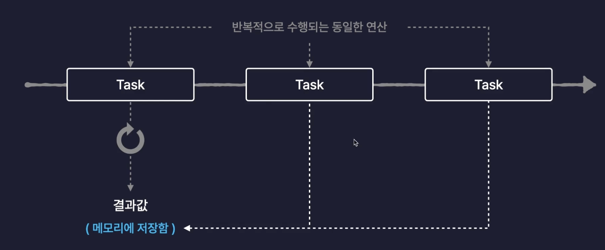
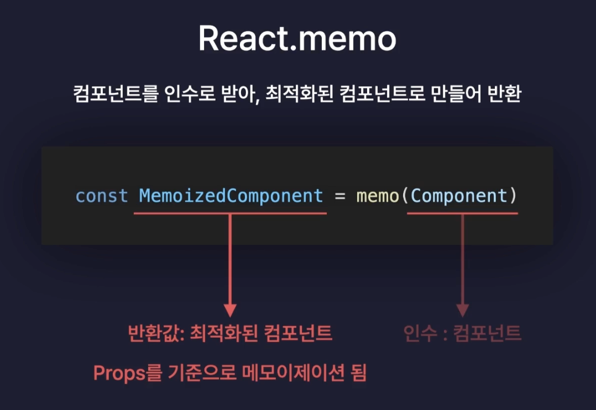
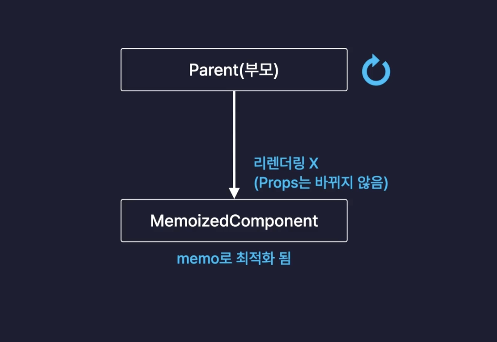

# 최적화 (Optimization)

: 웹 서비스의 성능을 개선하는 모든 행위를 일컫음 , 아주 단순한 것부터 아주 어려운 방법까지 매우 다양함

## 일반적인 웹서비스 최적화 방법
- 서버의 응답속도 개선
- 이미지, 폰트, 코드 파일 등의 정적 파일 로딩 개선
- 불필요한 네트워크 요청 줄임

## React App 내부의 최적화 방법
- 컴포넌트 내부의 불 필요한 연산 방지
- 컴포넌트 내부의 불 필요한 함수 재생성 방지
- 컴포넌트의 불 필요한 리렌더링 방지

### useMemo
: **메모이제이션**기법을 기반으로 불필요한 연산을 최적화 하는 리액트 훅

- 메모이제이션 기법을 사용하면 최초 한번 결과값을 저장해 놓으면 다음부터는 같은 연산을 불필요하게 다시 수행할 필요할 필요가 없음

### React.memo
컴포넌트를 인수로 받아, 최적화된 컴포넌트로 만들어 반환

- momoized된 컴포넌트는 부모 컴포넌트가 리렌더링 되더라도 자신이 받는 props가 바뀌지 않으면 다시 리렌더링이 발생하지 않음 

#### 최적화를 언제하면 좋을까?
리액트를 최적화 할 때는 하나의 프로젝트를 거의 완성한 상태에서 하게된다.
- 1. 기능 구현
- 2. 최적화
    - **최적화가 풀리거나 고장나는 경우**가 생기기 때문에 기능 구현이 먼저다
    - 유저의 행동에 따라 개수가 굉장히 많아질 수 있는 컴포넌트
    - 함수들을 굉장히 많이 가지고 있어서 코드가 무거운 컴포넌트에 한해서만 최적화 수행
