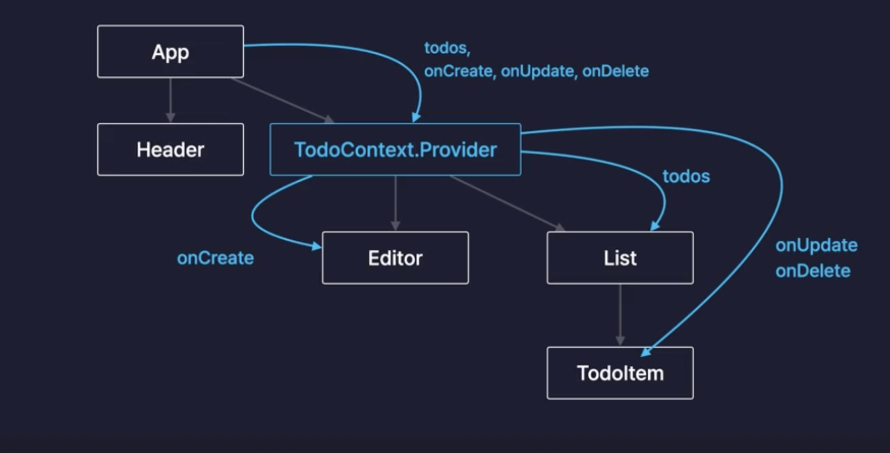

# React Context

: 컴포넌트간의 데이터를 전달하는 또 다른 방법, 기존의 Props가 가지고 있던 단점을 해결할 수 있음

### Props 의 단점 : Props Drilling

Props 는 부모 -> 자식으로만 데이터를 전달 할 수 있었음

- 컴포넌트의 계층구조가 두단계 이상으로 깊어지게 되면 다이렉트로 전달할 수가 없다 (데이터 이중 전달)

- 서비스의 규모가 커지면 복잡해진다. -> **Props Drilling**

### Context

: 데이터 보관소 역할을 하는 (객체)

- 여러개 만들기 가능
  

### 왜 최적화가 풀리는 문제가 발생?

Provider 컴포넌트도 엄연히 React의 컴포넌트이기 때문에 앱 컴포넌트로 부터 Value Props 로 제공받는 TodosState 와 onCreate, onUpdate, onDelete를 감싸고 있는 객체가 바뀌게 되면
-> Props가 바뀌게 되면 리렌더링이 발생

- 하위 컴포넌트 입장에서는 부모컴포넌트가 리렌더링되는 상황이기 때문에 함께 리렌더링이 발생하게 된다.

- memo method를 통해 props가 바뀌지 않으면 아예 리렌더링을 발생시키지 않도록 설정해둔적이 있다. 그런데 why it happend?

- 투두스 스테이트가 변경이 되어서 앱 컴퍼넌트가 리렌더링이 될 텐데 그때 이 프로바이더 컴퍼넌트에게 Value Props로 전달하는 이 객체 자체가 다시 생성이 되기 때문

- 메모를 적용했더라도 이렇게 useContext로부터 불러온 값이 변경이 되면 이것은 props가 변경된 것과 동일하게 리렌더링을 발생시키기 때문

### 어떻게 해결할 수 있을까?

- 변경 될 수 있는 값들은 **TodoStateContext**를 만들어서 공급을 하고 변경되지 않는 함수들은 **TodoDispatchContext**로 분리해서 공급

- 새로운 일기가 추가되거나 수정되거나 삭제가 된다 라고 하더라도 ToDoList 컴포넌트만 값을 불러다가 쓰고 있기 때문에 결과적으로는 다른 컴포넌트들은 리렌더링이 되지 않을 거고 TodoList 컴포넌트만 리렌더링이 된다.